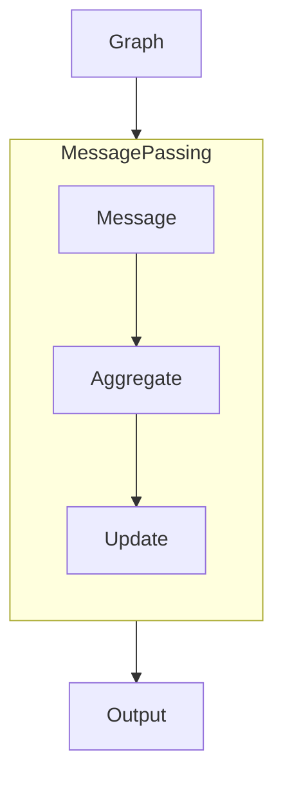

# System Architecture  
## Core Components  
### Graph Class  
```python
class Graph:
    def __init__(self, 
                 node_features: torch.Tensor,  # [num_nodes, num_features]
                 edge_index: torch.Tensor,     # [2, num_edges]
                 edge_weights: Optional[torch.Tensor] = None):
```

### MessagePassing Base Class
```python
class MessagePassing(nn.Module):
    def forward(self, x, edge_index, edge_weights=None):
        # 1. Compute messages
        # 2. Aggregate neighbors
        # 3. Update node features
```
### Data Flow

### Design Principles
- **Extensibility:** Subclass MessagePassing for custom layers
- **Type Safety:** All inputs/outputs type-hinted
- **Validation:** Check tensor shapes during initialization