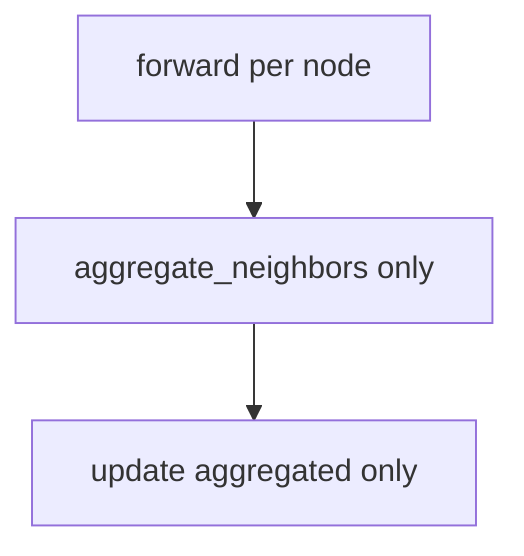
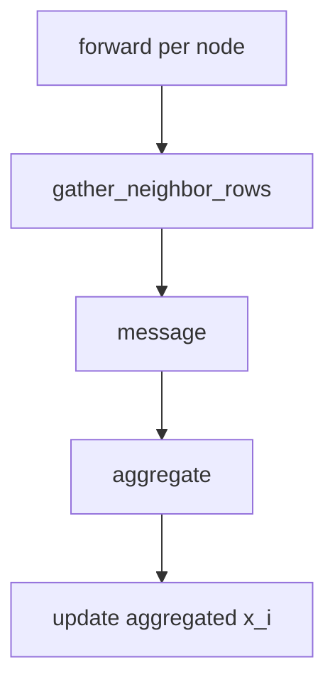

# System Architecture

## Core components

### Graph class

```python
class Graph:
    def __init__(
        self,
        node_features: torch.Tensor,  # [num_nodes, num_features]
        edge_index: torch.Tensor,     # [2, num_edges]  (source, target) = (row0, row1)
        edge_weights: Optional[torch.Tensor] = None,
        directed: bool = False,
    ):
```

Incoming neighbors of node `i` are sources `j` on edges `j -> i` (`edge_index[1] == i`).

### MessagePassing base class

Public API (unchanged for callers):

```python
out = layer(x, edge_index, edge_weights=None)  # [num_nodes, in_features]
```

Internally, for each target node `i`:

1. ``gather_neighbor_rows`` stacks weighted source rows for edges into the target node (per [`Graph`](../src/data/graph.py) edge direction).
2. `messages = message(x_i, weighted_x_j)` (default: identity on weighted rows).
3. `aggregated = aggregate(messages, weights, x_i)` (default delegates to `reduce_neighbor_messages` with `aggr`).
4. `out_i = update(aggregated, x_i)` (default: return `aggregated`).

### Message passing: baseline vs current base

| Aspect | Before refactor | Current |
|--------|----------------------|---------|
| `message()` | Defined but never used; neighbors used raw `x[neighbors] * w` inside `aggregate_neighbors` only | Weighted neighbor rows are passed through `message()` before reduction |
| `aggregate()` | No-op stub on the class | Public and overridable; default uses `reduce_neighbor_messages` |
| `update()` | `(aggregated)` only | `(aggregated, x_i)` so layers can mix self and neighbors |
| `aggregate_neighbors()` | Same reduction rules as today | Unchanged externally; used by tests and by `reduce_neighbor_messages` after optional `message` in the layer |
| `forward(x, edge_index, edge_weights)` | Same tensor contract | Same tensor contract |

### Earlier data flow (monolithic forward)


```mermaid
flowchart TB
  forward[forward per node] --> aggOnly[aggregate_neighbors only]
  aggOnly --> upd[update aggregated only]
```

### Current data flow


```mermaid
flowchart TB
  forward[forward per node] --> gather[gather_neighbor_rows]
  gather --> msg[message]
  msg --> aggr[aggregate]
  aggr --> upd[update aggregated x_i]
```

### Convolutional layers (Phase 2)

- **GCNConv**: symmetrically normalized adjacency with self-loops (`symmetric_normalized_gcn`), neighbor sum, then `Linear` on the aggregated vector per node.
- **GraphSAGEConv**: mean aggregation over neighbors (no built-in self-loop), `Linear` on `concat(x_i, aggregated)`.
- **GATConv**: subclasses `MessagePassing`; single-head attention with masked softmax over in-neighbors; implements `message` / `aggregate` / `update` (same incoming-neighbor convention as `Graph`).

### Data: Cora-style loading

`load_cora_dir(root)` reads `cora.content` and `cora.cites` (each cite line is turned into two directed edges). Official Planetoid train/val/test index files are **not** read. The loader always synthesizes boolean masks in code (`src/data/cora.py`): enough for demos, tests, and `train_cora.py`, but **not** the standard Cora split from the literature. For comparable numbers to published work, pass your own masks or extend the loader to read the real split files.

### Training

`src/train/node_classification.py` provides `train_epoch` and `evaluate` for one graph and boolean masks.

### Design principles

- **Extensibility:** Subclass `MessagePassing` and override `message` / `aggregate` / `update`; or use dedicated layer modules.
- **Type hints:** Tensor shapes documented in docstrings.
- **Tests:** Small deterministic graphs; Cora tests use `tests/fixtures/cora_mini` (no network in CI).
